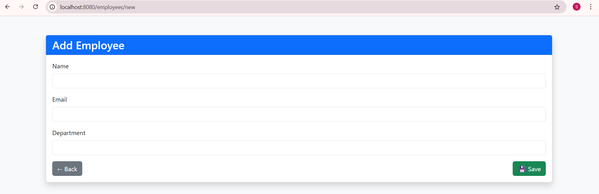
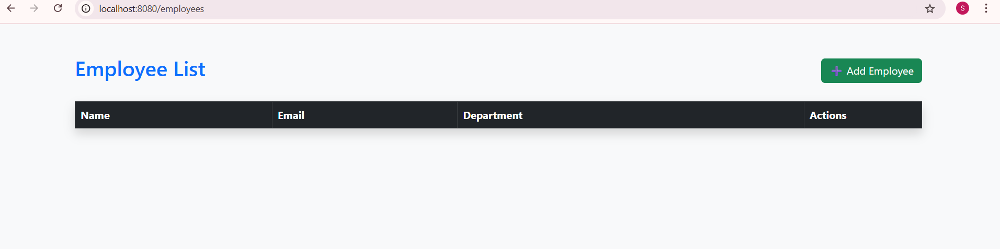

# Employee Management System
🚀 A simple Spring Boot web app for managing employee records. Supports full CRUD operations (Create, Read, Update, Delete) with a clean and intuitive Thymeleaf frontend.

✨ Key Features: 

➕ Add, 👁️ View, ✏️ Edit, and 🗑️ Delete employee details

💻 Built with Spring Boot, Spring Data JPA, and MySQL

🎨 Responsive UI styled using Bootstrap 5

🌐 RESTful architecture with MVC design pattern

